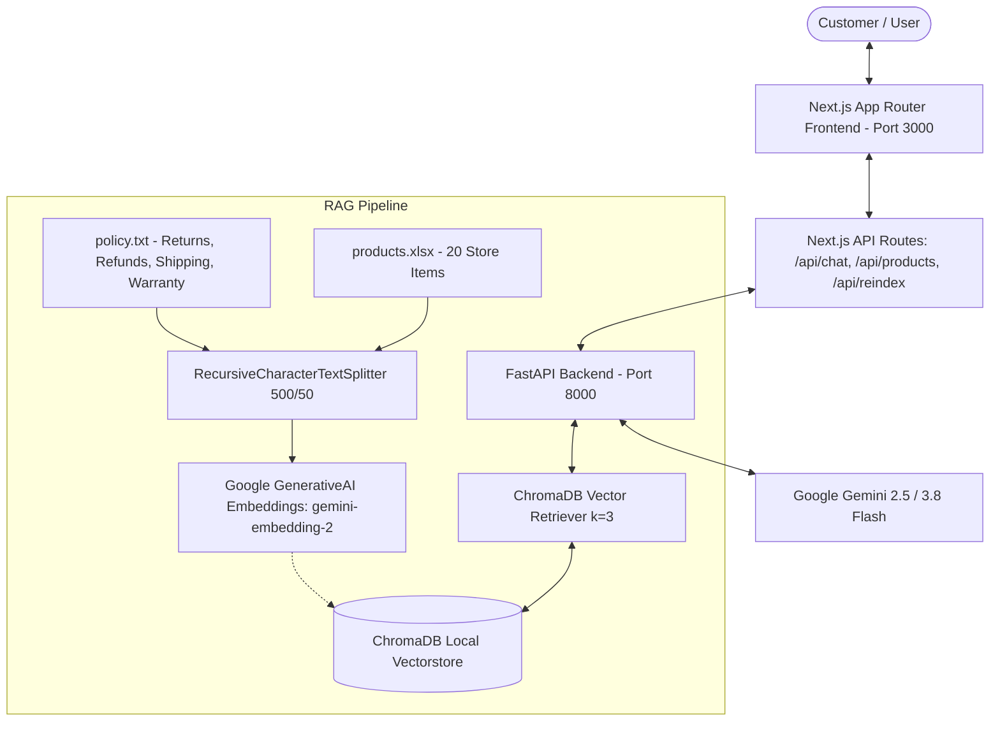

# Mind_Dream-AI-Customer-support-

**Mind_Dream** is a complete, production-ready full-stack AI support agent and interactive e-commerce dashboard built with **Next.js (App Router, Tailwind CSS)** and a **Python (FastAPI + LangChain + ChromaDB)** RAG backend powered by **Google Gemini**.

---

## 🏗️ Architecture Overview



---

## ✨ Features

### 1. Modern Dashboard Layout & Real-Time Chat Widget
- **Agent Identity**: "Mind_dream" — polite, helpful customer sales and support specialist for TechMart.
- **Chat Header**: Online status indicator (`Online • typically replies instantly`), restart chat action, minimize/fullscreen expand toggle, and RAG knowledge inspector trigger.
- **Active Context Strip**: Real-time status indicator showing live catalog connection and ChromaDB vector store synchronization.
- **Message History Area**:
  - Full Markdown rendering with GitHub Flavored Markdown (`remark-gfm`).
  - Rich comparison tables with zebra striping, headers, and stock badges.
  - Distinct User vs AI chat bubbles.
  - Helpful response feedback (Thumbs Up / Thumbs Down / Copy to clipboard).
  - Expandable source inspector for every retrieved chunk from ChromaDB.
- **Interactive Action Chips**:
  - `📦 Track my order`
  - `🔍 Check product availability`
  - `💳 What is your refund policy?`
  - `💻 Compare MacBook Air vs Legion Pro`
  - `🛡️ Warranty coverage details`
  - `⚡ Shipping rates & free delivery`
  - `🎧 Best headphones available`
- **Chat Input Bar**:
  - Sticky composer with file attachment support (`.txt`, `.pdf`, `.xlsx`, `.png`, invoices, etc.).
  - Voice recording input simulation.
  - Enter-to-send with loading spinner and disabled state.
  - Grounding micro-copy indicator.

### 2. Live Product Catalog & Spec Comparison Hub
- Interactive inventory table loaded dynamically from `products.xlsx` (20 items across Laptops, Phones, Headphones, Tablets, Keyboards, Mice).
- Category filtering and live search.
- Select up to 3 products to generate instant side-by-side comparison tables in chat.
- One-click **"Ask AI"** button for any product to inquire about specs, warranty, or stock.

### 3. Orders & Return Eligibility Verification Hub
- Interactive order tracking table (MacBook Air M3, Galaxy S25 Ultra, Logitech MX Keys S, Sony WH-1000XM5).
- One-click **"Verify Return"** button evaluating returns against the 15-day electronics / 30-day general policy window.

### 4. Strict Guardrails & Grounding
- **Product & Pricing Queries**: Answered strictly using retrieved context from `products.xlsx`.
- **Policy Queries**: Evaluated strictly using `policy.txt`.
- **No Hallucinations**: If an answer cannot be found in the retrieved context (e.g. asking for unrelated brands or products), Mind_dream responds strictly with:
  > **"I don't know"**

---

## 📦 Package Installation

### Backend Dependencies (Python 3.11+)
```bash
pip install langchain-google-genai langchain-community langchain-chroma langchain-text-splitters chromadb pandas openpyxl fastapi uvicorn python-dotenv pydantic
```

### Frontend Dependencies (Node.js 18+)
```bash
cd frontend
npm install
# Already includes: next, react, react-dom, tailwindcss, lucide-react, react-markdown, remark-gfm
```

---

## 🚀 Running Locally

### Step 1: Environment Variables
Ensure your `GOOGLE_API_KEY` is present in `.env` and `frontend/.env.local`:
```env
GOOGLE_API_KEY=your_gemini_api_key_here
```

### Step 2: Start the Python Backend (Port 8000)
```bash
cd backend
python -m uvicorn main:app --host 127.0.0.1 --port 8000 --reload
```
*Health check:* `http://127.0.0.1:8000/api/health`

### Step 3: Start the Next.js Frontend (Port 3000)
```bash
cd frontend
npm run dev -- -p 3000
```
*Open in browser:* `http://localhost:3000`

---

## 🧪 Verified Test Queries

| Query Type | Prompt | Mind_dream Behavior |
| :--- | :--- | :--- |
| **Product Comparison** | *"Compare MacBook Air M3 and Lenovo Legion Pro 5"* | Outputs clean Markdown comparison table with prices ($799.99 vs $499.99), stock (8 vs 15), and key specs. |
| **Policy Query** | *"What is your refund policy?"* | Cites 5-day processing, original payment method, and 15-day electronics / 30-day standard return windows. |
| **Electronics Return Check** | *"Can I return a phone purchased 21 days ago?"* | Rejects return based on the strict 15-day electronics policy. |
| **Out-of-Scope Guardrail** | *"Do you sell Gucci leather handbags?"* | Strictly responds: **"I don't know"**. |

---

## 📂 Project Directory Structure

```
AI Agent Nextjs/
├── backend/
│   ├── chroma_db/             # Persisted ChromaDB vector embeddings
│   ├── main.py                # FastAPI REST endpoints (/api/chat, /api/products, /api/reindex)
│   ├── rag_engine.py          # Document loaders, splitter, gemini-embedding-2, Gemini Flash LLM
│   └── requirements.txt       # Python package list
├── frontend/
│   ├── src/
│   │   ├── app/
│   │   │   ├── api/
│   │   │   │   ├── chat/route.ts       # Next.js API proxy to FastAPI
│   │   │   │   ├── products/route.ts   # Live inventory route
│   │   │   │   └── reindex/route.ts    # ChromaDB reindex route
│   │   │   ├── globals.css             # Theme variables, Markdown table styling
│   │   │   ├── layout.tsx              # Root HTML, Inter font, SEO meta
│   │   │   └── page.tsx                # Main dashboard & chat application
│   │   └── components/
│   │       ├── ActionChips.tsx         # Quick query prompt chips
│   │       ├── ChatHeader.tsx          # Mind_dream status & actions
│   │       ├── ChatInput.tsx           # Sticky composer with attachments & mic
│   │       ├── KnowledgeBaseView.tsx   # RAG inspector & policy explorer
│   │       ├── MessageList.tsx         # Markdown chat history & sources
│   │       ├── OrderTrackingView.tsx   # Orders hub & return eligibility
│   │       └── ProductCatalogView.tsx  # Searchable 20-item products table
│   └── package.json
├── policy.txt                 # Source store policy document
├── products.xlsx              # Source product spreadsheet (20 items)
├── .env                       # Backend API configuration
├── package.json               # Root workspace scripts
└── README.md                  # Complete documentation
```
